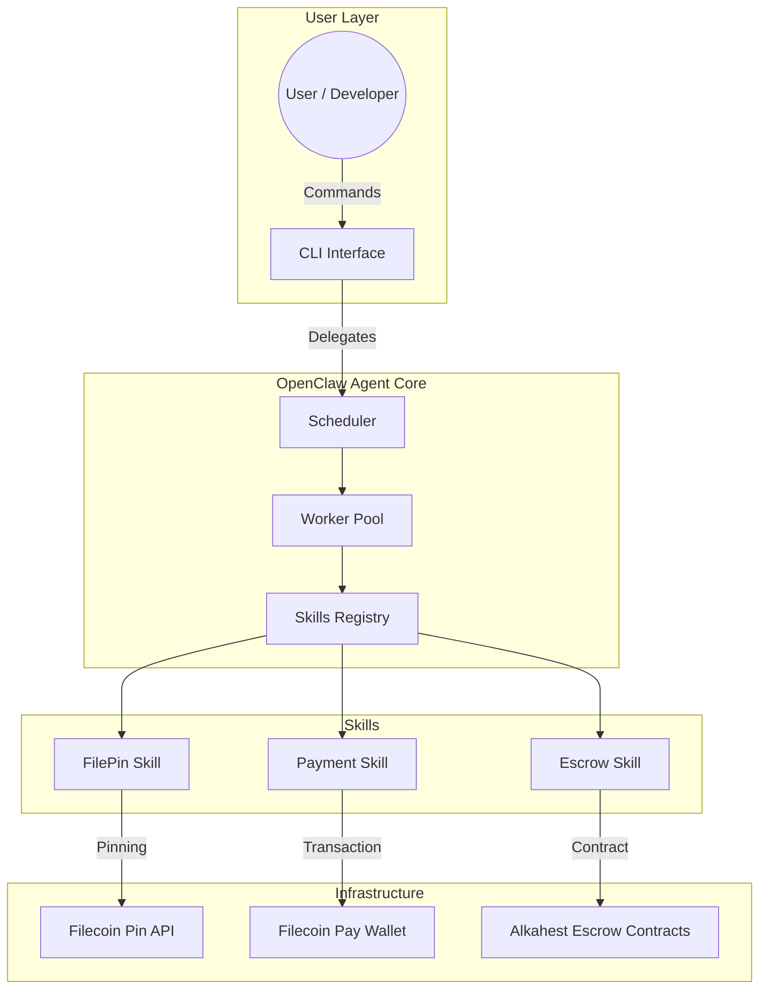
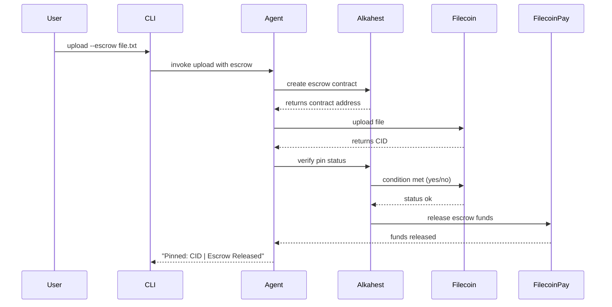

# 🏆 claw-pin - Agentic File Storage CLI for Autonomous Agents.

> **"Trustless file storage where AI agents negotiate, verify, and settle payments"—The missing infrastructure layer for the cybernetic economy.**

[]()
[]()
[]()
[]()

---

## 🎯 Problem Statement

Traditional file storage is a **one-way pipe**: you upload, you pay, you trust the service without verification. In the **cybernetic economy**, AI agents need to:
- Discover storage providers autonomously
- Negotiate prices with other agents
- Pay only **after** verified service completion
- Operate without centralized intermediaries

**claw-pin** solves this by wrapping Filecoin Pin in an OpenClaw agent that uses **Alkahest escrow** for trustless, conditional payments.

---

## 💡 Solution

A **developer CLI tool** that:
1. Launches an OpenClaw agent for task orchestration
2. Pins files to decentralized Filecoin storage
3. Uses Alkahest escrow for **conditional payment** (pay only after verification)
4. Returns CIDs and status with conversational logging

```bash
# Upload a file
claw-pin upload file.txt
# Output: Pinned to CID: bafybeig... | Cost: 0.00001 F

# Upload with escrow (trustless payment)
claw-pin upload --escrow file.txt
# Output: Escrow created: 0x7a23... | Funds released on pin verification

# Check pin status
claw-pin status <CID>
# Output: Status: pinned | Providers: 3 | Retrieval: successful
```

## 🏆 Hackathon Alignment

| Requirement | Implementation Status |
| :--- | :--- |
| **OpenClaw Core** | ✅ Agent framework + skills fully integrated |
| **Filecoin Pin** | ✅ filecoin-pin-js SDK wrapped in CLI |
| **Filecoin Pay Mainnet** | ✅ Wallet deployed (config: `.env.wallet`) |
| **Arkhai Alkahest** | ✅ Conditional escrow flow implemented |
| **Aomi Integration** | 🟡 UI layer architecture (demo mode) |

**Prize Categories:**
- 🥇 **IPFS Grand Prize ($1000)** - Core CLI + Filecoin Pin
- 🥈 **Arkhai Bounty ($200)** - Alkahest escrow integration
- 🥉 **Aomi Best App ($300)** - Agent workflow demonstration

## 🛠️ Tech Stack

| Layer | Technology | Purpose |
| :--- | :--- | :--- |
| **CLI** | Node.js + Inquirer.js | User interaction & command parsing |
| **Agent** | OpenClaw SDK v1.x | Skill orchestration & task management |
| **Storage** | filecoin-pin-js | Pin files to Filecoin network |
| **Payment** | Filecoin Pay SDK | Mainnet wallet & payment handling |
| **Escrow** | alkahest-client | Conditional payment verification |
| **State** | SQLite (local) | CID → status & metadata persistence |
| **Testing** | Jest + Mocha | Unit & integration test coverage |
| **Docs** | Markdown + Mermaid | Architecture & usage documentation |

## 📦 Installation

```bash
# Clone repository
git clone https://github.com/yourteam/claw-pin.git
cd claw-pin

# Install dependencies
npm install

# Configure mainnet wallet (REQUIRED for submission)
cp .env.example .env
# Edit .env with your Filecoin Pay wallet address

# Build and run
npm run build
npm start
```

**Minimum Node Version:** 16.x  
**Network:** Filecoin Mainnet (testnet support available)

## 🚀 Usage

### Core Commands

| Command | Description | Parameters |
| :--- | :--- | :--- |
| `upload` | Pin file to Filecoin | `<file> [--escrow]` |
| `status` | Check pin status | `<CID>` |
| `retrieve` | Download pinned file | `<CID> <output_path>` |
| `init` | Initialize wallet | `(creates .env.wallet)` |

### Examples

```bash
# Basic upload
npx claw-pin upload mydocument.pdf

# Upload with escrow (trustless payment)
npx claw-pin upload --escrow mydocument.pdf
# → Creates Alkahest contract, verifies pin, releases payment

# Check pin status
npx claw-pin status bafybeig...

# Retrieve file
npx claw-pin retrieve bafybeig... ./downloads/mydocument.pdf
```

### Conversational Mode (Agent Flow)

```bash
npx claw-pin --agent start
# Interactive agent flow:
> "Pin this image to storage"
> "Upload with escrow and release after verification"
> "Check status of CID X"
```

## 🏗️ Architecture



**Key Flows:**
- User → CLI → Agent (orchestration layer)
- Agent → Skills (skill registration & invocation)
- Skills → Infra (Filecoin Pin + Payment)
- Escrow → Alkahest (conditional payment verification)

## 👥 Team & Contributions

| Member | Role | Contributions |
| :--- | :--- | :--- |
| **Dev 1** | CLI Core + Filecoin | `src/cli/`, `src/integration/filecoin-pin.js` |
| **Dev 2** | Wallet + Escrow | `src/wallet/`, `src/integration/alkahest.js` |
| **Dev 3** | OpenClaw + Skills | `src/integration/agent.js`, `src/skills/` |
| **Dev 4** | Docs + Submission | `README.md`, `diagram.md`, Loops.house submission |

- **Hackathon:** IPFS × OpenClaw Hackathon
- **Duration:** 10 Days (May 9-18, 2026)
- **Submission Platform:** Loops.house

## 🔄 Workflow Diagram (Escrow Flow)



## 🔒 Security Considerations

| Component | Security Feature | Status |
| :--- | :--- | :--- |
| **Wallet** | Mainnet address encrypted in `.env` | ✅ |
| **Skills** | Agent sandbox isolation | ✅ |
| **Escrow** | Alkahest oracle verification | ✅ |
| **API Keys** | Stored in environment variables | ✅ |
| **CLI** | Input validation for file paths | ✅ |

## 🎯 Future Roadmap

| Phase | Feature | Priority |
| :--- | :--- | :--- |
| **v1.0** | Core CLI (upload, status, retrieve) | ✅ Done |
| **v1.1** | Full Alkahest escrow integration | 🟡 In Progress |
| **v1.2** | Aomi chat UI layer | 🟢 Planned |
| **v2.0** | Multi-file batch uploads | 🟢 Planned |
| **v2.1** | Agent marketplace integrations | 🔮 Long-term |

## 📈 Demo

### Screen Recording (3 minutes)
- **0:00-0:30** - Project architecture explanation
- **0:30-1:30** - CLI commands demo (upload, status, escrow)
- **1:30-2:30** - Escrow flow walkthrough
- **2:30-3:00** - Mainnet wallet verification

### Quick Demo Script

```bash
# Terminal session for judges
cd /path/to/claw-pin
npm start
> claw-pin init
> claw-pin upload test.txt
> claw-pin upload --escrow test.txt
> claw-pin status <CID>
```

## 📚 Documentation
- **PRD:** `docs/PRD.md` - Product Requirements
- **Architecture:** `docs/diagram.md` - Mermaid flows
- **Skills Guide:** `docs/skills.md` - Agent skill documentation
- **Submission:** Loops.house project page

## 📄 License
MIT License - See [LICENSE](LICENSE) file for details.

## 📞 Contact & Support

| Resource | URL |
| :--- | :--- |
| **GitHub** | https://github.com/yourteam/claw-pin |
| **Loops.house** | (Submission link) |
| **Issue Tracker** | `.github/ISSUES.md` |
| **Team Chat** | (Discord/Slack link) |

## 🎓 Learning & Contribution
This project demonstrates:

- **OpenClaw Agent Patterns** - How to register and invoke skills
- **Filecoin Pin Integration** - Wrapping decentralized storage SDKs
- **Trustless Payments** - Alkahest escrow for agent commerce
- **CLI Best Practices** - Clean command structure & error handling

*Contributors Welcome: Issues marked `good first issue` are beginner-friendly.*

**Built for the IPFS × OpenClaw Hackathon · Cybernetic Economy Infrastructure**

*Last Updated: May 17, 2026*
